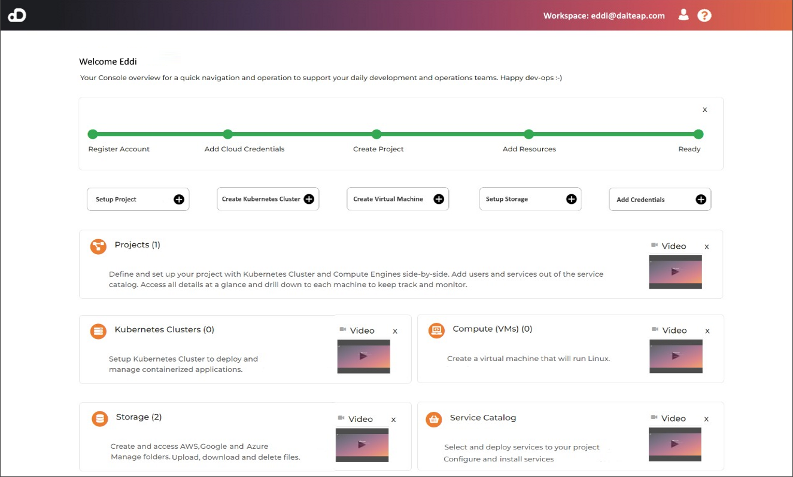

# Daiteap Cloud Console

URL [daiteap.com](https://www.daiteap.com/)

[License Apache 2.0](./LICENSE)

This repo contains the Daiteap Cloud Console, which is a browser application
used to interact with the daiteap platform.



## Development Environment

### Start Devcontainer

There are 2 ways to start the devcontainer

From VS Code:

- Install Dev Containers extension in VS Code
- From Remote Explorer tab -> Dev Containers -> + New Dev Container
  -> Open Current Folder in Container

From Terminal:

- Install `devcontainers`
- Execute

```bash
# start devcontainer
devcontainer up --workspace-folder .
# start vscode
code .
```

- Attach VSCode to the running devcontainer

Once the devcontainer is created, this script `.devcontainer/build-ui.sh`,
which install the necessary dependencies for the UI, is executed automatically,
wait for it to complete - you can see the progress in the terminal, inside the devcontainer.

If the script fails with this error - `Restarting nginx: nginx. failed`,
change the `listen` port in `app/nginx/dev.conf`.

### Changing Ports

By default these ports are used:

- UI -> 8095
- Docs -> 8085

If any of these ports are already in use on your machine,
go through the scripts mentioned below and `app/nginx/dev.conf`
and change the ports to the ones you want to use.

### Configuration

To be able to use the platform fully you need to have the devcontainer
from the `daiteap-platform` repository running as well.

- Use the Keycloak address from `daiteap-platform` devcontainer
  (default <http://127.0.0.1:8082/auth/>) to change
  `auth-server-url` in `daiteap-ui/app/public/keycloak.json`

- From your machine connect to the cluster in `daiteap-platform` devcontainer
  and port-forward the `platform-api` service with this command
  (replace `local_port` with the port you want to use
  and use that same port in `app/nginx/dev.conf` at `location /server/`):

```bash
kubectl -n daiteap port-forward service/platform-api local_port:8080
```

- Execute these commands, inside the `daiteap-ui` devcontainer,
  to setup Nginx config and restart Nginx service:

```bash
sudo cp app/nginx/dev.conf /etc/nginx/sites-enabled/cloudcluster.conf
sudo service nginx restart
```

### Run UI (execute the commands inside the `daiteap-ui` devcontainer)

```bash
cd app
export VUE_APP_THEME=daiteap
export VUE_APP_SINGLE_USER_MODE=False
npm run serve -- --port 8084
```

Access the UI on <http://localhost:8095/>.

Use this address in Keycloak,
by changing the URL settings of `app-vue` and `django-backend` clients.

### Build & Run Docs (execute the commands inside the devcontainer)

```bash
./.devcontainer/build-run-docs.sh
```
