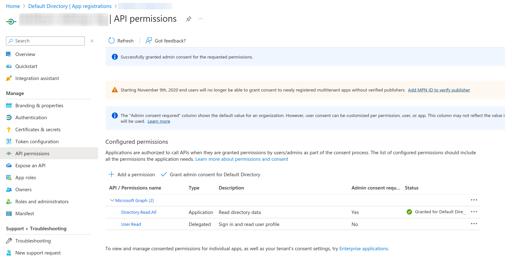

# Cloud Credentials

Platform uses resources from external infrastructure providers to create and manage resources like VMs (Compute), Kubernetes clusters and storage. The first step before using the platform is to configure Cloud Credentials, which will connect to the various infrastructure APIs.
Shared Credentials can be used by all users in the tenant, otherwise a credential can only be used by admins and the user who added them.

When creating a new cloud credential, the platform will check the validity of the new credential in the backgroup when pressing the **Save** button. The same validation check can be triggered on already existing cloud credentials in the table by clicking the check mark button in the Status column of the table. If something is wrong with the credential like missing permissions or access, an error message will be displayed showing what the problem is. In generat, it shouldn't be possible to create an invalid cloud credential. See [Check Credential Status](#check-credential-status).

!!! note
    Cloud Credentials are internally persisted to a <a href="https://www.vaultproject.io/" target="_blank">Hashicorp Vault</a> data store. This is done to ensure extra protection for this sensitive data. Vault provides RBAC control, data encryption and access audit. Once credentials are created from the users, it is not possible to see or edit sensitive fields.


## Google Cloud

### OAuth
The easiest way to create a new Google cloud credentials is to use OAuth. To use OAuth, click the link `Use OAuth` and follow the on-screen instructions. Alternatively, one can create the credential manually by following the steps below.

We will need access to the "https://www.googleapis.com/auth/cloud-platform" scope.

### Manual configuration

Requirements:

* working GCP cloud account

* **Compute API** enabled in GCP APIs

* **Cloud DNS API** enabled in GCP APIs

* **Cloud Asset API** enabled in GCP APIs

* **Cloud Resource Manager API** enabled in GCP APIs

You can find the APIs <a href="https://console.cloud.google.com/apis/" target="_blank">here</a>.


To configure the GCP cloud credential, one must create a service account in GCP under **APIs & Services -> Credentials -> Create credentials -> Service account**. Fill in an unique **Service account ID**, detailed **Name** *(ex. NAME-daiteap-cloudcredential)* and **Description** *(with workspace and other platform information)* and finish by clicking DONE. Then click on the created service account, select **KEYS** tab and create new JSON key type. The create key function will generate and download a JSON file, which must be uploaded to the Daiteap platform when creating the cloud credential.

Then we must grant permissions for this service account. Go to **IAM & Admin -> IAM -> Add** and select the just created service account under **New principals**. Then add the following roles:

* **Compute Admin**
* **Storage Admin**
* **DNS Administrator**
* **Service Account User**
* **Cloud Asset Viewer**
* **Security Reviewer**
* **Compute Image User**

After uploading the JSON file and clicking Save, the cloud credential will be ready for use.

## Amazon AWS

For AWS, only manual configuration is supported. Steps to configure new credential:


Create a new user. Go to **Services -> IAM -> Users -> Add user**, input new name and select **Programmatic access**.

For permissions, attach the following policies:

* **AmazonEC2FullAccess**
* **AmazonS3FullAccess**
* **ResourceGroupsandTagEditorReadOnlyAccess**
* **AmazonRoute53FullAccess**
* **IAMReadOnlyAccess**
* **AWSOrganizationsReadOnlyAccess**

Create the user. Copy and paste the **Access key ID** and **Secret access key** from AWS into the corresponding Daiteap fields.

## Microsoft Azure

### OAuth
The easiest way to create a new Azure cloud credentials is to use OAuth. To use OAuth, click the link `Use OAuth` and follow the on-screen instructions. Alternatively, one can create the credential manually by following the steps below.

We will need access to the "https://management.azure.com/user_impersonation" scope.

### Manual configuration


To create cloud credential for `Microsoft Azure` you will need to know the following fields:

* `Tenant ID` - the tenant ID identifying the tenant for you Azure account.
Go to **Tenant properties** and copy the `Tenant ID`

* `Subscription ID` - the ID for the subscription you want to use in Azure. 
Go to **Subscriptions**, select the subscription you want to use and copy the `Subscription ID`.

* `Client ID` - the application (Daiteap) that will access and manage Azure resources.
To create a new Client, go to **Azure Active Directory -> App registrations** and create new **New registration** by clicking the ADD button. 
Fill in the input fields:

  Name: "Daiteap"  
  Supported account types: "Accounts in this organizational directory only (Default Directory only - Single tenant)"  

And click **Register**. Copy the **Client ID** of the newly created application.

* `Client Secret` - the secret used to authenticate the client application in Azure
While having selected the newly created client application, click on **Certificates & secrets -> New client secret**. Add description and Expire time and click **Add**. Copy the **Value** field which must be entered in the Daiteap **Azure Client Secret** box.

At last, we need to grant permissions to the newly created client application which will defined which resources and action Daiteap can perform on the configured Azure cloud credential. For this, we will create a custom role in the Azure IAM service and will assign this role to the client application from the previous step.

Go the the **IAM** tab and on Subscription you used. Click **Add -> Add custom role**. The role name `DaiteapRole` will be automatically filled. For Baseline permissions select **Start from JSON**. The JSON file will the needed permissions can be downloaded <a href="/azure_custom_role.json" download>here</a>. Click **Next** and finally create the role.

At last we create a RoleAssignment, which will map the role to the client application. Click on **Role assignments -> Add role assignment**, select the custom role **DaiteapRole**, click **Next -> Members -> Select members** and search the created client application by name. The select it and click Select and finish the creation of the role assignment.

### Add Microsoft Graph permimission and admin consent



There's one API permission that you need to give your application. Go to App registrations -> Select your client application -> API permissions -> Add a permission -> Microsoft Graph -> Application permissions -> Directory.Read.All, after that the permission needs to be granted by an admin.
After granting the permission, press the checkbox `Grant admin consent for Default Directory` and then make sure the Status fields shows that the access is granted.

### Azure Storage Account
!!! note
    Creating a new cloud credential of type Azure will automatically trigger the creation of a storage account under the connected cloud account. This account will be used to manage S3 storage for Azure. Beware that it is not automatically deleted when the cloud credential is removed.


## SecuStack

* SecuStack credentials are configured manually in the UI.
* To configure credentials, click on the "Cloud Credentials" option in the navigation. Click on the plus icon next to the "Add Cloud Credentials".

### Create New Cloud Credential

* Click on `Add Cloud Credentials`
* In Secustack Configuration Window fill in:
    * Cloud Credentials Name ( required ) - A name for your Cloud Credentials.
    * Cloud Credentials Description (optional) - The description of the Cloud Credentials.
    * Application Credential ID ( required ) - The ID of the application credential from your SecuStack credential.
    * Application Credential Secret ( required ) - The secret of the application credential from your SecuStack credential.
    * Region Name ( required ) - The name of the SecuStack region you want to use.
    * Auth URL ( required ) - The URL of the SecuStack authentication endpoint.
    * External Network ID ( required ) - The ID of the SecuStack external network.
    * Shared Credentials - When checked, the credential will be available for all users in the tenant.
* Press "Save" button
* An automatic credential check will be started by the platform.
* In case the check fails, a warning message will be shown with tips on how to fix the issue. 
* In case the check is successful, the cloud credential will be saved and ready for use.

* If you need help on how to generate SecuStack cloud credentials follow the configuration instructions below:
    * Install and configure the OpenStack client:
        1. Install the <a href="https://docs.openstack.org/newton/user-guide/common/cli-install-openstack-command-line-clients.html" target="_blank">OpenStack Command Line Client</a>
        2. Open the OpenStack Dashboard
        3. Select the appropriate project
        4. On top left click on **API Access**
        5. On the right side if you click on **View Credentials**, Authentication URL parameter will be shown
        6. On the right side click **Download SecuStack RC File**
        7. With terminal interface and the rc file from the previous step execute ```chmod 700 ./openrc.sh```
        8. Execute this command in your terminal interface ```source ./openrc.sh```
    * Create Application Credential:
        1. To create the application credential object execute ```SecuStack application credential create "name of the application credential"```
        2. After successfully creating the application credential you will be prompted with **Field-Value** table with the required **ID** and **Secret** parameters
    * Get Region Name:
        1. Execute ```cat ./openrc.sh | grep OS_REGION_NAME```
    * Get Auth URL:
        1. Execute ```cat ./openrc.sh | grep OS_AUTH_URL```
    * Get External Network ID:
        1. Go to SecuStack Dashboard
        2. Select the appropriate project
        3. On top left click on **Project** => **Network** => **Networks**
        4. Click the network you want to use for the external network
        5. From Overview tab get the **ID** of the network
* If you have any questions, please contact your SecuStack administrator.

### Edit Credential
!!! note
    This functionality is for the convenience of the users when managing the configured credentials. Changing the credential name does not change the application credential name in the cloud provider!

* Click on the "Cloud Credentials" option on the navigation
* Click on the "Edit" icon of the credential you want to edit
* Change any of the editable fields of the credential
* Click on the "Save" button

### Remove Credential
!!! note
    This functionality removes the configured credential only from the platform and does not affect the application credential in the cloud provider! The removal doesn't delete any actual cloud resources.

!!! note
    Before removing the credential, make sure that the credential is not used in any of the created clusters.


* Click on the "Cloud Credentials" option on the navigation
* Click on the "Remove" icon
* Press "Remove" button

### Check Credential Status

!!! note
    This feature verifies if credentials have all needed permissions to manage resources at a given provider and verifies region/zone/instance type parameters! Also it will check if the provided external network id is valid, and if the linux images are available.


Clicking on the `Status` column initiates a status check for the configured Cloud Credential. It will check the following parameters:


* Connectivity to the infrastructure: 
If connectivity fails, one or more of the following fields are configured incorrectly: `Application Credentail ID`, `Application Credential Secret`, `Region Name`, and `Auth URL`.
* External Network ID
* Images - if this error occurs, users must contact the administrator for the infrastructure.
* Storage permissions - checks if your credentials have the necessary roles to use Cloud Storage:
    * AWS - AmazonS3FullAccess
    * Azure - Storage Blob Data Contributor, Storage Blob Data Owner, also checks if there is at least 1 storage account, which can be accessed with the credential
    * Google - Storage Admin
* Compute API - with Google credentials, the Compute API must be enabled for the project, you can check it by visiting the <a href="https://console.cloud.google.com/marketplace/product/google/compute.googleapis.com" target="_blank">GCP Compute Page</a>