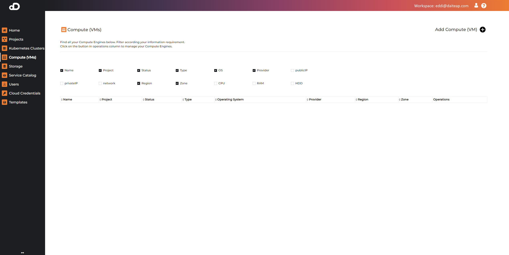
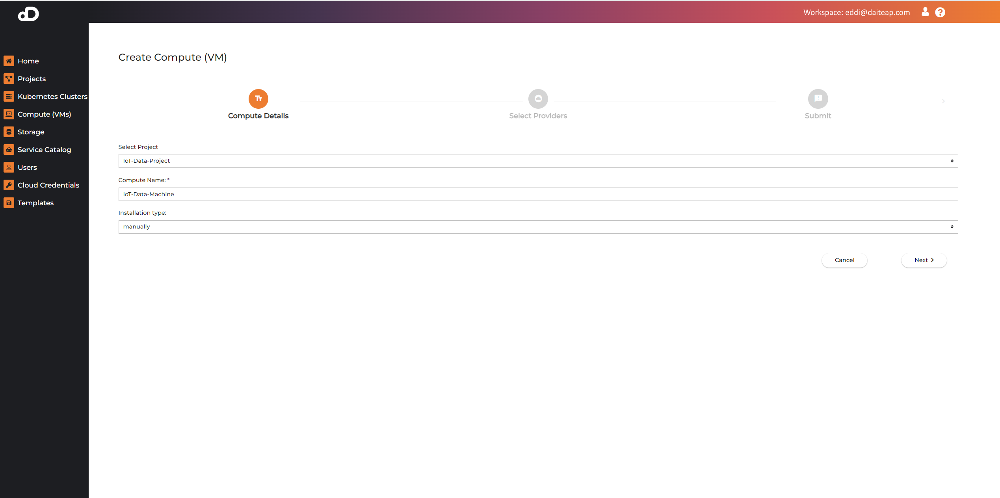
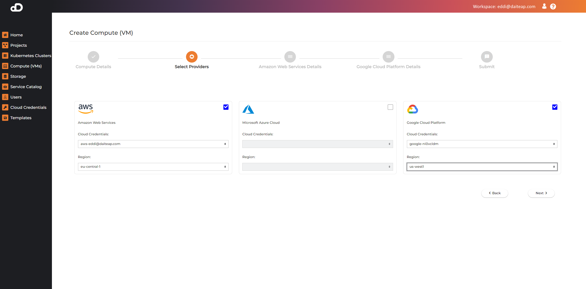
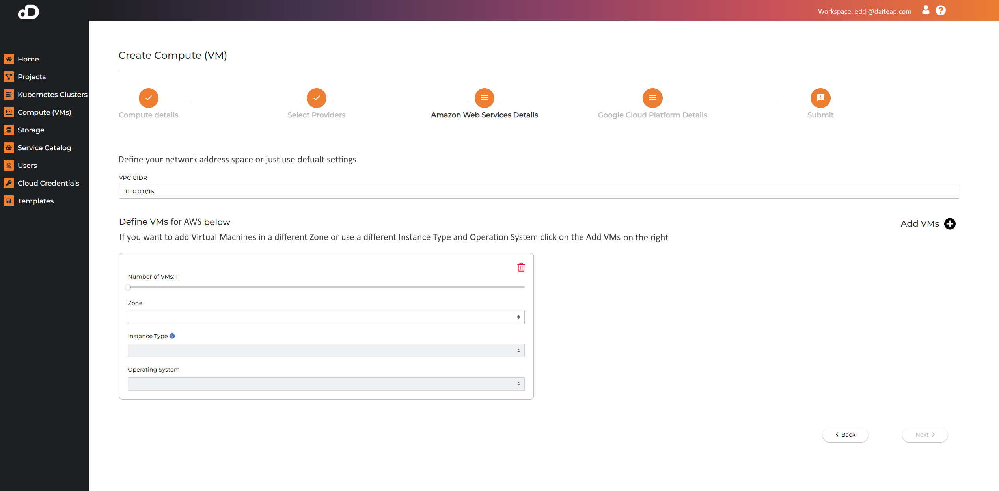
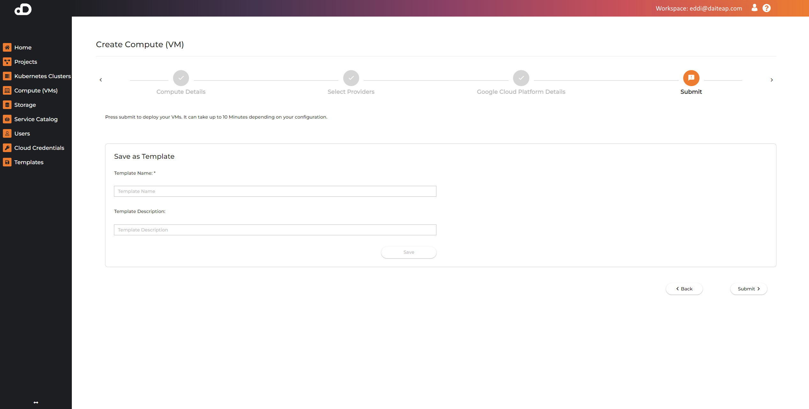

# Compute (Virtual Machines)

Compute allows users to create and manage clusters of VMs. 
We introduce a new concept of managing Virtual Machines. When you create a Compute VM resource it is always a cluster of one or more Virtual Machine Ms. 
This has the advantage of being able quickly scale (resize), as well as the ability to span your Virtual Machines across more than one cloud provider. 
**E.g. you can have VMs being part of one provider like GCP and others in another cloud provider like AWS within the same Network**. 
Each compute cluster providers direct IP connectivity on the private IP addresses of the VMs by using VPN. This means that while each VM has private IP and subnet from the local cloud provider, it can reach other VMs in the same compute cluster on their own private IPs directly without needing and external public IP. VM clusters also have an DNS which is able to resolve hostnames between cloud providers.


## Add Compute 

Creating a new Compute (VM) Cluster start with the "Add Compute (VM)" button.



### Provide Description



You need to add your data and select the project where the Compute Cluster will be created, input `name` and select `installation type`. 
If `template` installation type is selected, then the cluster configuration will be taken from an already existing template.You do not need to specify further details. If `manually` is chosen, go to next step and select your IaaS providers.

### Select Provider



This step allows the selection of one or more Cloud Provider to create Compute Cluster. You need to add for each provider a single cloud credential. Addtionally select a region.

### Define Compute Size



To define the size of the Virtual Machine you can select pre-configured sizes for each selected cloud provider. Please add also the number of VMs. 
You can add VMs by Clicking `Add VMs` and you will get a box which is a grouping of one or more VMs of the same type. For each box the following parameters must be provided:

- Number of VMs
- Zone (within the previously selected region)
- Instance type - also called flavour of certain providers, this is the VM size including vCPUs, Memory and Disk allocated to each VM within the group
- Operating System - a dropdown list of currently supported OSs in the platform

### Template and Submit



The last step shows the submit function and also the ability to save the currect compute configuration as template for future use.

## Access Compute VMs via SSH

Users can use SSH to access Compute (VM) resources with this command:
```
ssh -i <path-to-private-key-file> '<username>'@<vm-public-ip>
```
* `<path-to-private-key-file>` - path to the private key file, that's paired with the public key you have set in your profile
* `<username>` - your username on the platform; make sure to enclose the username with '' as it may contain the **@** character
* `<vm-public-ip>` - the public IP of the VM you want to access, which can be seen on the Compute (VMs) page