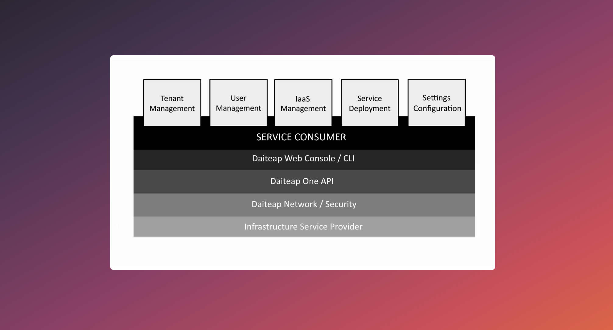
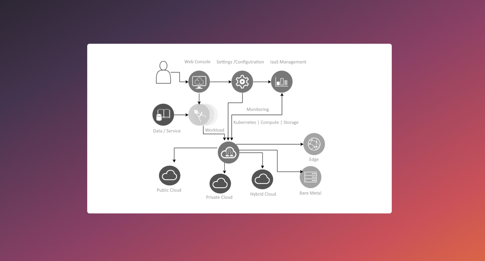

## Introduction

** Multi-Cloud but Simple **

Reduce 100% complexity with quick automated setup of multi-provider Kubernetes Cluster, Virtual Machines and Storage.
Additionally you have a Tenant/Workspace Adminstration, Project and User Management as well as an integrated Service Catalog 
for seamless multi-provider integration and service deployment. 

The Daiteap Cloud Solution Platform offers a lightweight solution to essential cloud infrastructure ressources.  
You can choose between our ** Web Console **, our ** Command Line Interface (CLI) ** or use our unified ** APIs ** to connect and manage your IaaS ressources. 
You can use our purpose build dev-ops self-service Web Console or CLI to easily set up, operate and manage cloud infrastructure ressources like 

-  Kubernetes Cluster, 
-  Virtual Machines, 
-  S3 Storage, 
-  Longhorn Storage 
-  Application Service Catalog. 

 

With the Daiteap Cloud Management Platform it is comfortable and easy to use above mentioned services from your preferred provider or even deploy and span infrastructure multi-region, multi-site across provider.
Currently we support infrastructure services of the following Platforms

-  Amazon AWS
-  Microsoft Azure
-  Google Cloud Platform
-  Alibaba Cloud 
-  Openstack
-  Secustack
-  Bare Metal 
-  On Premise

** Functional Overview **

The Daiteap Cloud Management Platform sits on top of infrastructure provider. As infrastructure provider we can use and deploy on

- Public Cloud service provider, 
- Private Cloud 
- Hybrid Cloud Setup
- Linux Servers
- Single Machine

We deploy the Cloud Management Platform as Container on Kubernetes or Docker running on the machine itself or on a virtual machine.  

