# Kubernetes Clusters

The Kubernetes clusters page is the place where you can access and manage all clusters across different projects to which the current user has access. Users can also create new clusters, resize existing ones, delete and perform operational tasks e.g. start/stop.

#### Muli-Provider Kubernetes

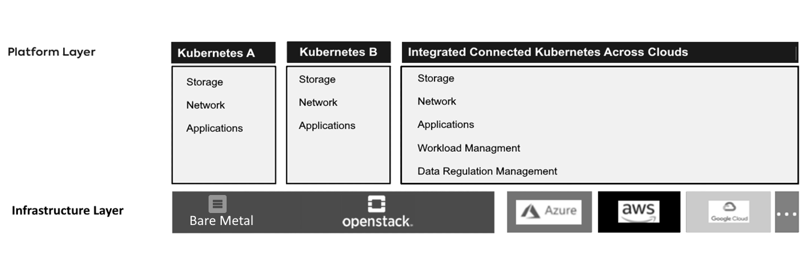

## Free Individual SaaS Version

Before creating a new cluster you must:

- be member in a project (either by creating a new one or being added to existing project)
- have access to at least one correctly validated cloud credential
- have enough quota

Once you are using our online SaaS free Individual Version you are able to use our pre-configured Kubernetes Cluster sizes.
Go to Kubernetes CLuster - Add your Cluster details...

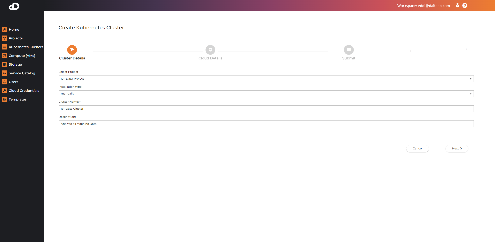

After adding your Cluster details click on next and you will find our pre-configured Kubernetes Cluster sizes which you can just select for your needs.
Select your provider. You can choose one or multiple provider at the same time. Multiple provider selection allows you to span a Kubernetes Cluster across Cloud Provider IaaS. 

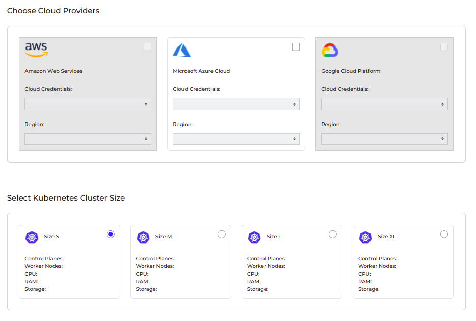

You need to select cloud providers, which credential and region to use, and choose the kubernetes cluster size. You can view details about each size, once the resource calculation is finished.

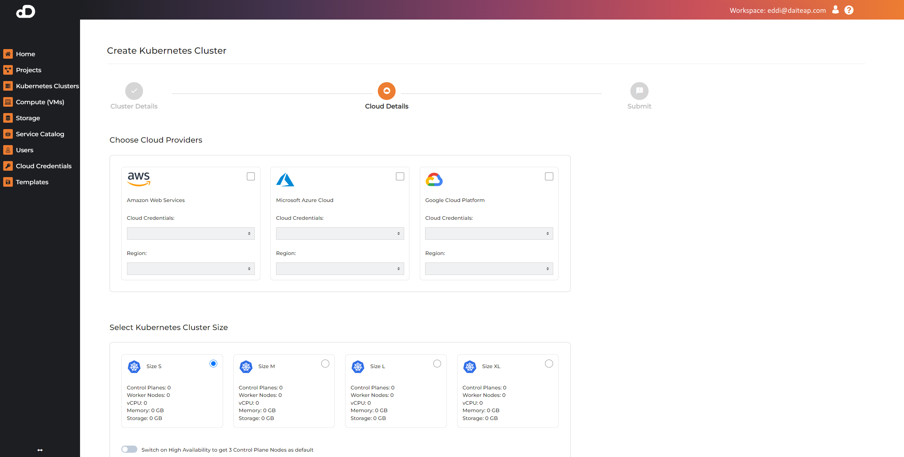

Choose HA Feature for High Availability to get three nodes in the control plane.
If you are done with your selection of your provider and cluster size press submit and the Kubernetes Cluster will be deployed.

## Creating New Clusters Team / Enterprise Version

This section describes the Team and Enterprise Version of Daiteap Multi-Cloud Platform, where you have more flexibility in choosing your cluster creation and feature setup.

Before creating a new cluster you must:

- be member in a project (either by creating a new one or being added to existing project)
- have access to at least one correctly validated cloud credential
- have enough quota

#### Add Kubernetes Cluster

To create a new cluster press `Add Kubernetes Cluster` button.

On the first page some general details about the cluster can be configured:  

- `Project` where this cluster will be created (required)  
- `Cluster Name` - free text (required)  
- `Description` - text description for the cluster (optional)  

Pressing `Advanced options` reveals additional configuration parameters:  

- `Kubernetes Version` - the version of Kubernetes that will be installed    
- `Kubernetes Internal Network for Services` - the IP address space for kubernetes services where addresses will be allocated from  
- `Kubernetes Internet Network for Pods` - the IP address space for Kubernetes pods   
- `Kubernetes Network Plugin` - the CNI network plugin for Kubernetes that will be installed  

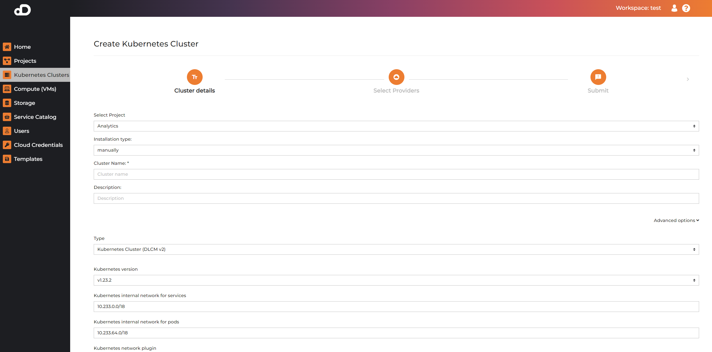

#### Select Provider

On the next page, the cloud infrastructure provider can be selected. The option will be disabled if no valid cloud credential for the corresponding cloud provider exists.

!!! note
    If you have selected multiple cloud providers, there should be at least 1 control plane node for each of them.

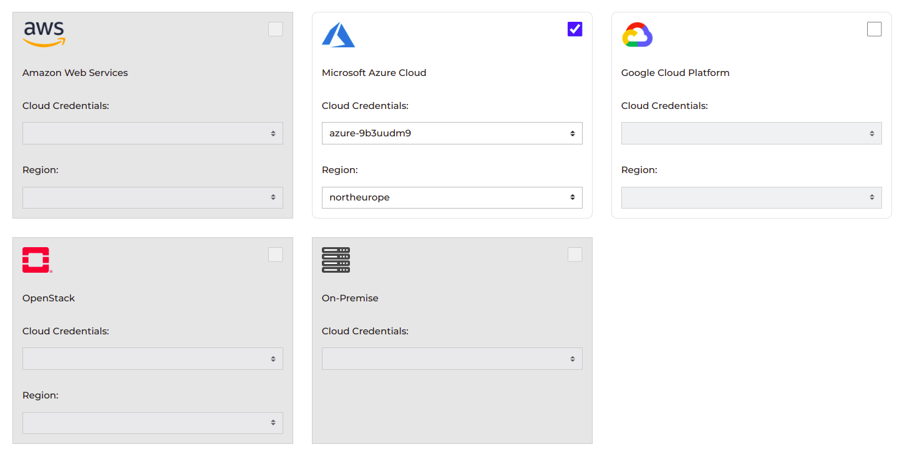

#### Cloud Ressource Configuration

The next page configures cloud resources for the selected cloud provider. At first, all input fields are automatically populated (might take a couple seconds). The configureable fields are:  

- `Cloud Credential` - a particular cloud credential that has already been configured and validated. 

Grouping of one or more of the machine types will set the final cluster configuration. The groupings can be of two types `Control Plane` and `Worker` nodes which indicate the type of each machine in the group as a Kubernetes Node. With such a grouping, the user has the flexibility to define control plane and worker nodes within a cluster using different sizes, instance types and operating systems. A reasonable configuration will be preselected initially, but it can be changed.

Machine Group Parameters: 

- `Node Type` - control plane or worker nodes in Kubernetes  
- `Number of Nodes` - number of nodes in this group. All have the same parameters. When node type is `Control Plane`, the number of nodes can only be an odd number, e.g. 1,3,5...  
- `Instance Type` - the machine flavor in SecuStack. This list can contain only flavors which specifications are meet the platform kubernetes requirements, therefore there could be some instance types in SecuStack which are not shown in the list.  
- `Operating System` - the SecuStack image to be used for the Kubernetes nodes  

Groups can be added and deleted, but at least 1 `Control Plane` group is required on every provider. The control plane node count accross all the selected providers must not be even number.

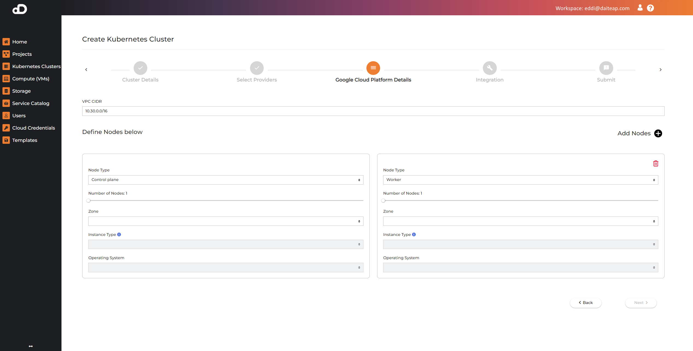

##### Custom Images

* Kubernetes clusters are using custom pre-build images. These images are uploaded by SecuStack administrators.
* Images are discovered by specific tags that are set in the image.
    * `daiteap_dlcm_v2`
* If the images are missing, please contact your SecuStack administrator.

#### Cluster Provisioning

The last page is the Submit. You can see a summary of selected resources or create a template of the cluster configuration. Pressing `Submit` initiates cluster creation. The time depends on the selected resources and speed of the infrastructure.

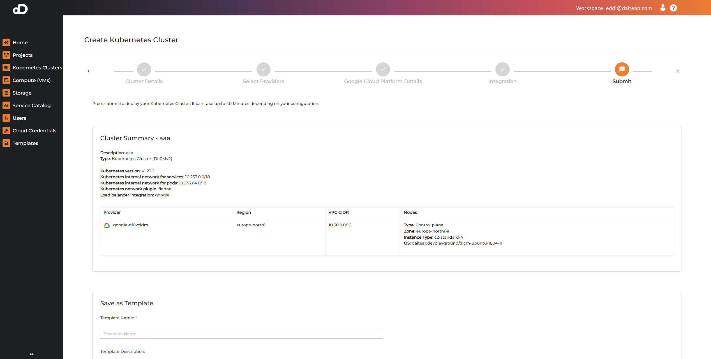

When the cluster creation is finished, an email is sent to the user's email address.

## Managing Running Clusters

The clusters page includes a table with all created cluster. For each of them the following information is shown - Name, Project, Description, Type, Provider, Created at, Created by, Status, Operations and Kubeconfig.

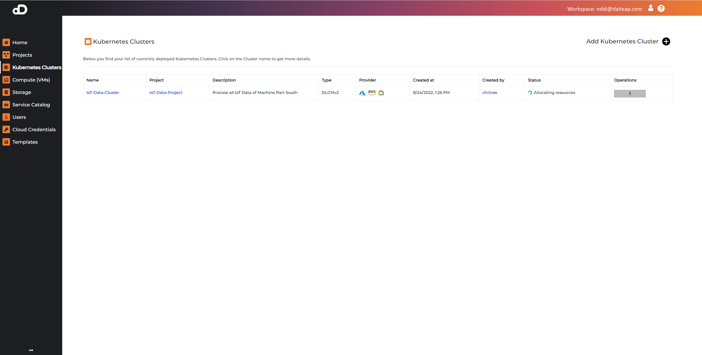

### Accessing Resource in the Cluster

By downloading the kubeconfig the user can use `kubectl` or other tools to connect and use the cluster.

### Cluster Operations

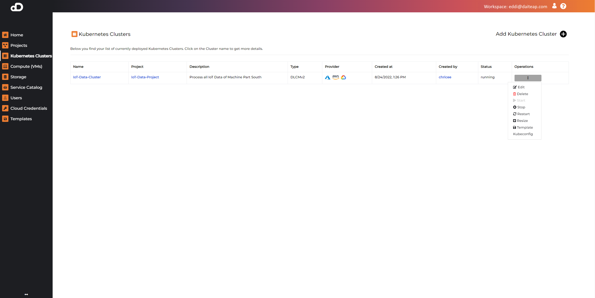

Clicking on `Operations` button, a list of features is shown:  
- `start` - starting a stopped cluster  
- `stop` - stop running cluster  
- `restart` - restart cluster  
- `delete` - deleting cluster  
- `resize` - change node groups of created cluster  

Pressing on `resize` shows the node groups which can be changed. Clicking Next->Submit will initiate the resize operation.

### KubeConfig

In order to work with your Kubernetes Cluster you would like to get the KubeConfig.
You can download the KubeConfig in the Operations Menu.

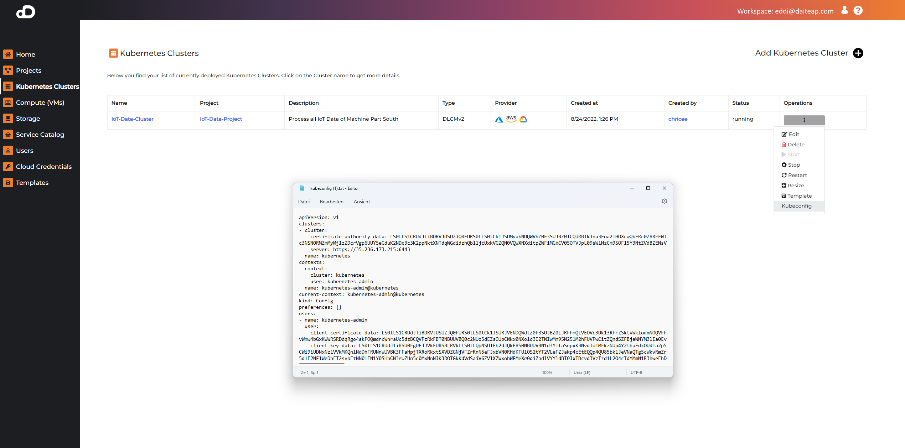

### Cluster Details Page

By clicking on the cluster name, a cluster details page is shown with detailed information about the cluster state.

Following information is shown:  

- `Nodes` - includes the kubernetes nodes, their roles, count and resource configuration (CPU, RAM, DISK)  
- `Longhorn storage` - by default, the platform installs a longhorn storage on the node disks which are part of the cluster. A default storage class `Longhorn` is configured, which can be used by the user and apps in the service catalog for persistent storage. This part of the page shows the storage space on each of the installed nodes.  
- `Services` - installed services from the [Service Catalog](service_catalog.md)  
- `Grafana` - Used for monitoring cluster resources.  
- `User Cloud Credentials` - list of the cloud credentials for the cluster  

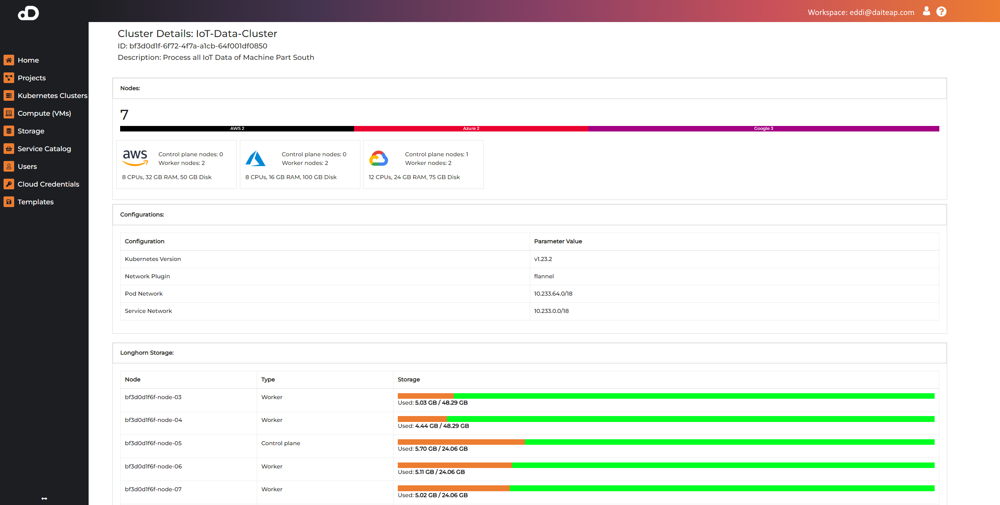

### How to Check Quota

It is possible for cluster creation to fail if there is no enough quota/resources. Therefore, it is good practice to also make sure that enough quota is available.

* Open the dashboard of your deployment you want to check.
* On the left navigation, click on Project -> Compute -> Overview.

