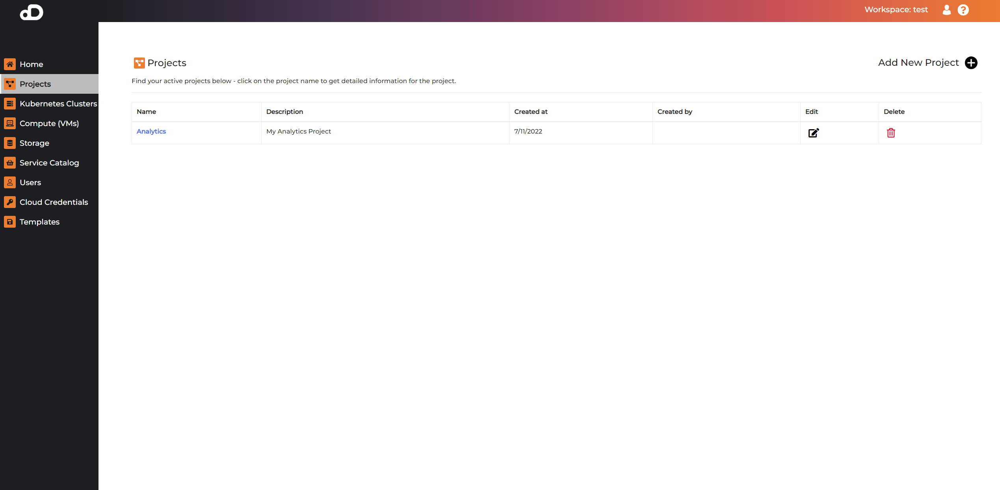

# Projects

A project is a logical grouping of resources and users. Users can create projects and add Kubernetes clusters to them. They can also share projects with other users by adding them to the project.

The project table names are clickable, which leads to the project details page. It contains information about the project and all clusters, services, and users associated with this project.

### Create Project

* Click on "Projects" on the left menu
* Press the "plus" button in "Add New Project" section
* Enter project name and description
* Click on "Save" button

### Delete Project

!!! note
    Make sure you have no resources in the project before deleting it.

* Click on "Projects" on the left menu
* Press the "trash" button in "Remove" section
* On the confirmation dialog, click on "Remove"

### Add Users to Project

* Click on "Projects" on the left menu
* Click on the project name
* Click on "Add User" button
* Select user from the list
* Click on "Add" button

When user is added to a project, it can access its resources like running applications, and clusters.

### Remove Users from Project

* Click on "Projects" on the left menu
* Click on the project name
* Press the "trash" button in "Delete" section
