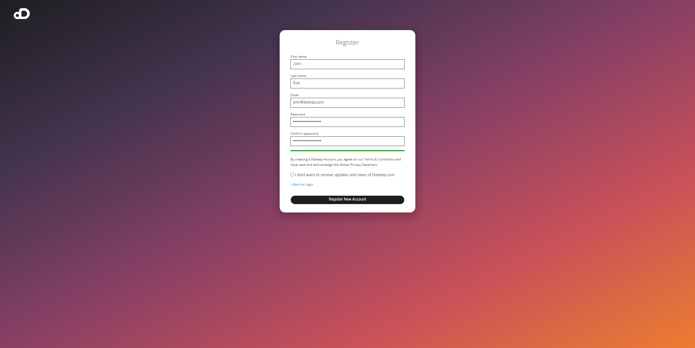
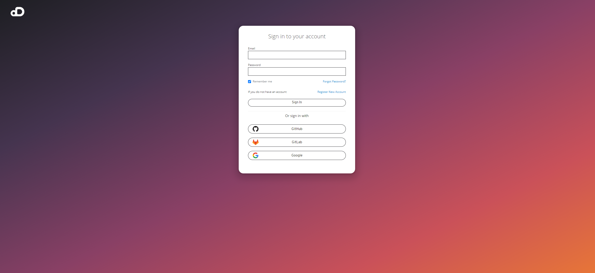

# Registration and Login

To use the Daiteap Multi-Cloud Management you need to register yourself to create a Daiteap Account or use your existing social login account.
Currently we support login with the following social login accounts

- GitHub
- GitLab
- Google

Once you are registered you have access and make use of the multi-cloud management services.

If you want to use the Team Version and want to have access to the Tenant Adminstration please contact us via our website or send and email to info@daiteap.com

## Registration

You can register your Diteap Account by entering the following Data. We try to keep it simple and don't ask for all kind of personal data. 
We just need the minimal nesseccary data to identify you in the platform.   

- Last Name 
- First Name
- Email
- Password

After you click on ** Register New Account ** you agree and accept our Terms & Conditions and we will send you an Email to your given Email-Address with a confirmation link.
Click the confimation link in your received Email and you will be looged in and re-directed to the Web Console Dashboard.  

## Sign In

We support currently four methods to sign in. You can use your registered Daiteap Account or you can choose one of the three Social Login offerings.
If you choose the Social Login method you will be redirect to either GitHub, GitLab, or Google to confirm usage of your ID to login into Daiteap Cloud Management Platform.
We do not collect any of the data provided besides of your email and username.  

