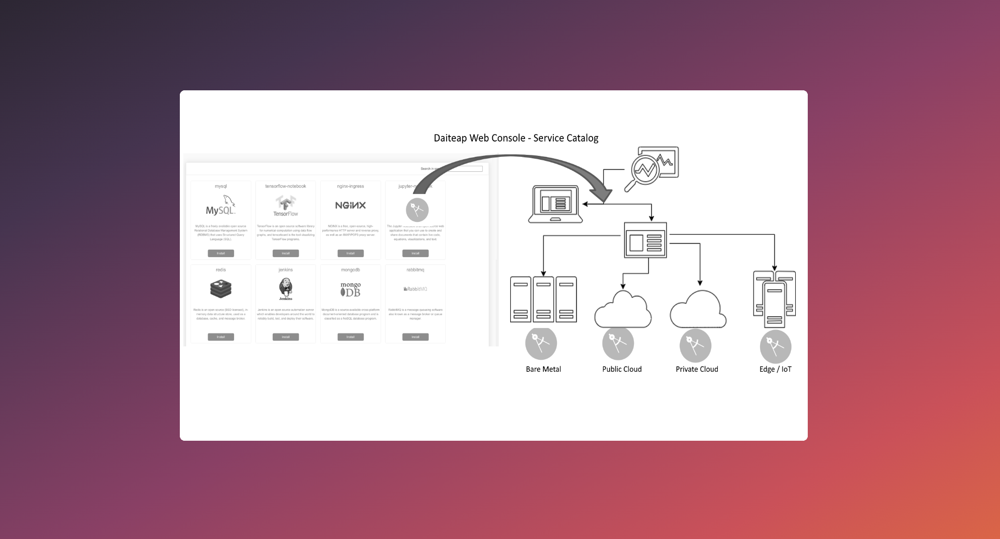
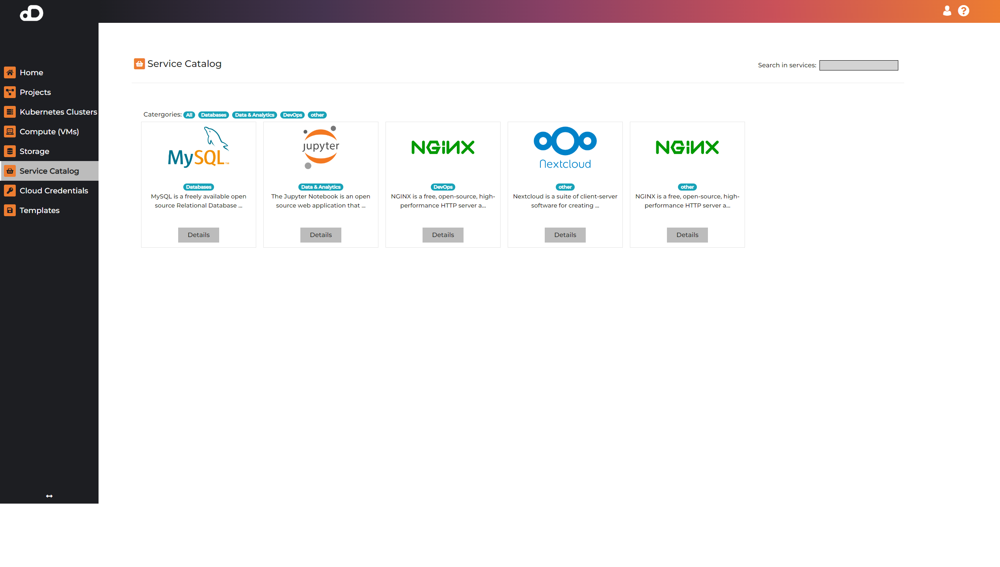
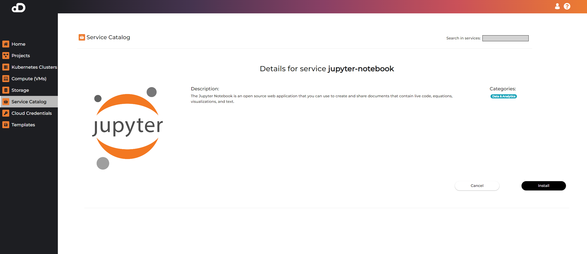

## Service Catalog





### Service Management
Services can be managed on the cluster details page of the cluster on which they are running. Services that can be access from the browser are getting "app.daiteap.com" subdomain name and a certificate in order to run in "https" mode. The cluster detail page can be found by clicking on the Kubernetes Clusters tab on the left and then on the name of the corresponding cluster.

Columns:

* **Name**: The name used to identify the service
* **Service Name**: The name of the service
* **Namespace**: Kubernetes namespace in which the service is deployed
* **Providers**: The providers that the service is installed on
* **Address**: Service access point, which is a link, for services that can be accessed from the browser
* **Status**: Installation status
* **Service Type**: The type of the service (NodePort or LoadBalancer)
* **Delete**: Delete the service

### Service Access

All Kubernetes Clusters, created with the platform, have:

* **Nginx Ingress Controller** - for managing ingress resources, that give services externally-reachable URLs
* **Cert-Manager** - for issuing certificates

To access a service, installed by the platform:

1. Click on Kubernetes Cluster from the left menu
2. Click on the Kubernetes Cluster that contains the service
3. In the Services card, click on the service name. Access information like password is available here.

To access a service, installed via Kubeapps:

!!! note
    The service needs to be of type ClusterIP.

* [Access the cluster](/documentation/kubernetes_clusters/#accessing-resource-in-the-cluster)
* Download the following files <a href="/certificate.yaml" download>certificate.yaml</a> and <a href="/ingress.yaml" download>ingress.yaml</a>, and edit:
    * `<service-name>` - the name you've given the service
    * `<service-namespace>` - the namespace, in which the service is installed
    * `<cluster-id>` - the first 10 symbols of your cluster's ID, excluding the '-'
    * `<service-port>` - the port of the service
* Create the resources:
```
kubectl create -f ./certificate.yaml
kubectl create -f ./ingress.yaml
```
* Once both are ready, you can access the service at:
```
<service-name>.<cluster-id>.app.daiteap.com
```

### Example



#### Jupyter-Notebook

The Jupyter Notebook is an open-source web application that allows data scientists to create and share documents that integrate live code, equations, computational output, visualizations, and other multimedia resources, along with explanatory text in a single document.



#### Nextcloud

Nextcloud is a suite of client-server software for creating and using file hosting services. It is enterprise-ready with comprehensive support options.

!!! note
    Clusters can have only one Nextcloud instance at a time.
