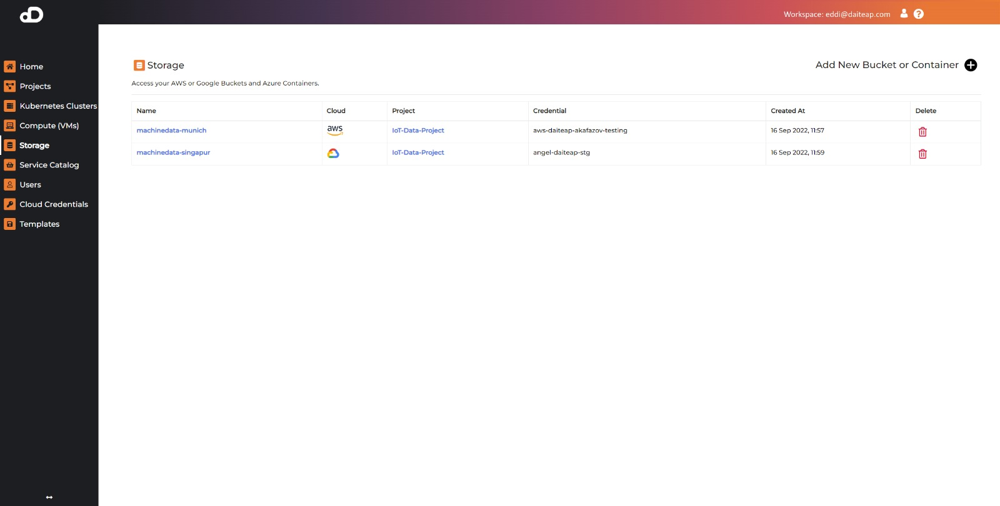
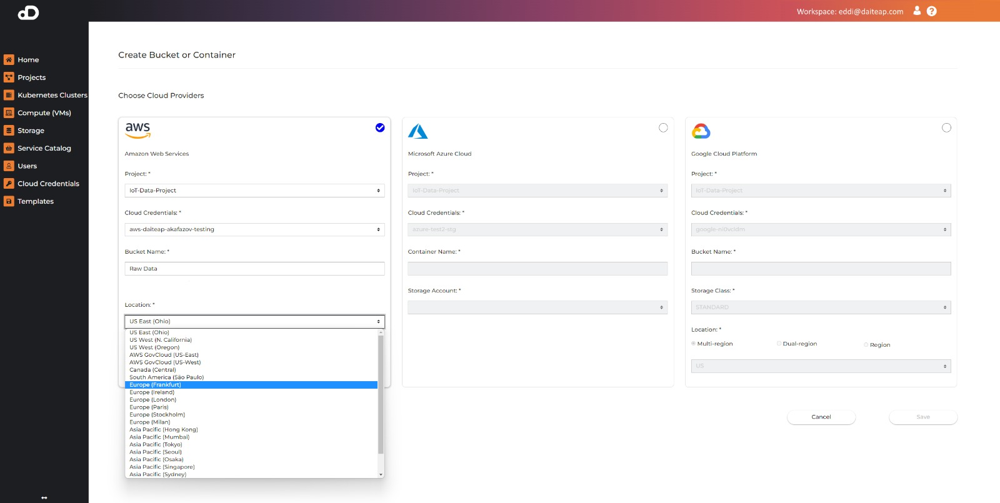
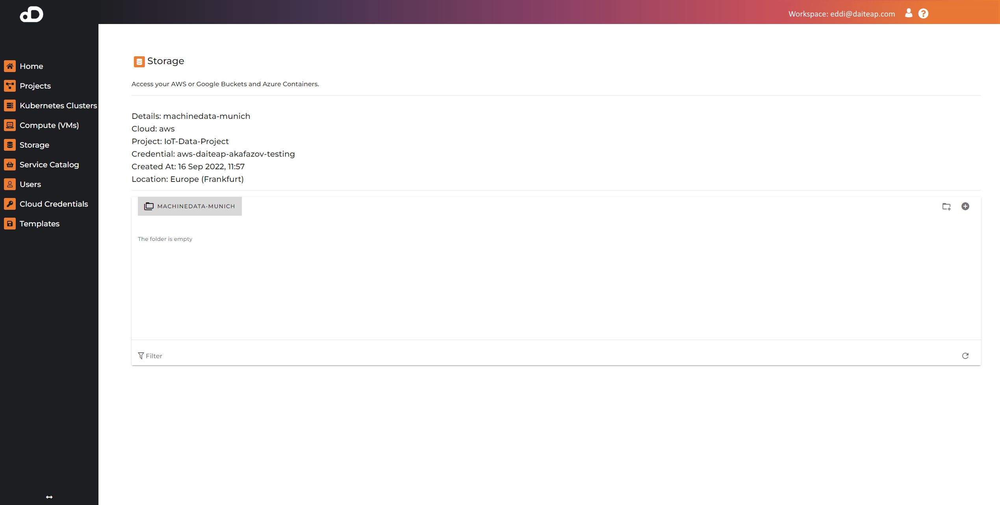

# Storage

Users can view and manage AWS or Google Buckets and Azure Containers, using their cloud credentials. Click on the `Storage` option in the sidebar to see all buckets/containers, that are associated with projects, you participate in, and can be accessed with your credentials.

!!! note
    Make sure your credentials have all the necessary permissions for the operations you're trying to perform, otherwise the operation will fail! You can [check the permissions of the credential](cloud_credentials.md#check-credential-status).

## Create New Buckets and Containers

* Click on `Add New Bucket or Container`
* Select cloud provider from the menu on top
* Fill in the fields
* Click `Save`

### AWS Bucket

* Fields:
    * Cloud Credentials ( required ) - The credential to use for the bucket.
    * Project ( required ) - The project that the bucket will be part of.
    * Bucket Name ( required ) - The name of the bucket.
    * Location ( required ) - The location in which the bucket will be created.

### Azure Container

* Fields:
    * Cloud Credentials ( required ) - The credential to use for the container.
    * Project ( required ) - The project that the container will be part of.
    * Storage Account ( required ) - The storage account in which, the container will be created.
    * Container Name ( required ) - The name of the container.

### Google Bucket

* Fields:
    * Cloud Credentials ( required ) - The credential to use for the bucket.
    * Project ( required ) - The project that the bucket will be part of.
    * Bucket Name ( required ) - The name of the bucket.
    * Storage Class ( required ) - The storage class of the bucket.
    * Location Type ( required ) - The type of the location of the bucket.
    * Location ( required ) - The location in which the bucket will be created.

### Bucket Naming Guidelines

* <a href="https://docs.aws.amazon.com/AmazonS3/latest/userguide/bucketnamingrules.html" target="_blank">AWS</a>
* <a href="https://docs.microsoft.com/en-us/rest/api/storageservices/naming-and-referencing-containers--blobs--and-metadata#container-names" target="_blank">Azure</a>
* <a href="https://cloud.google.com/storage/docs/naming-buckets" target="_blank">Google</a>

## Delete Bucket or Container

!!! note
    Bucket deletion will fail if the bucket is not empty.

* Click on the `Delete` icon
* Confirm the deletion

## View Bucket/Container Information

Click on the name of the bucket/container. At the top of the page you will find detailed information about it.

## Manage Files in the Bucket/Container

Click on the name of the bucket/container. At the bottom of the page you will find a file manager to interact with your files.

#### Create Folder

* Click on the `Create Folder` icon
* Enter a name for the folder
* Click `Create Folder`

#### Upload File

* Navigate to the folder you want to upload a file to
* Click on the `Upload File` icon
* Select the file you want to upload

#### Delete Folder or File

!!! note
    Deleting a folder will delete all the files in it as well.

* Click on the `Delete` icon
* Confirm the deletion

#### Download File

* Click on the `Download File` icon