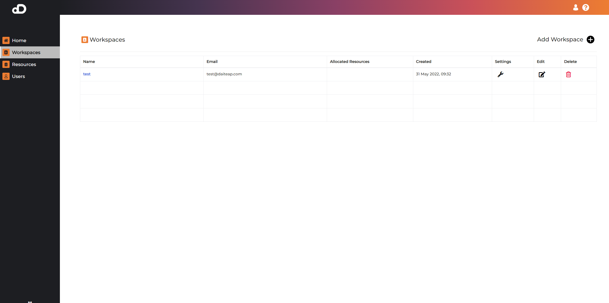
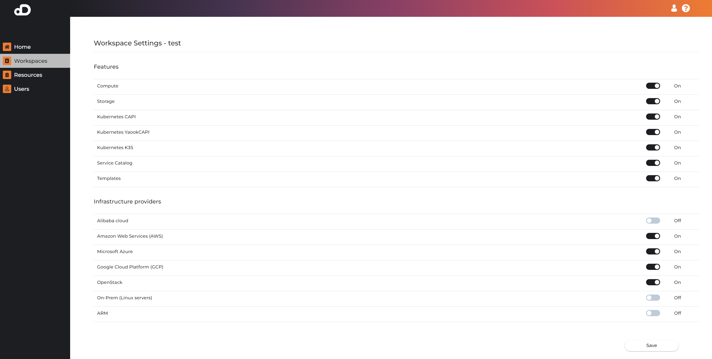
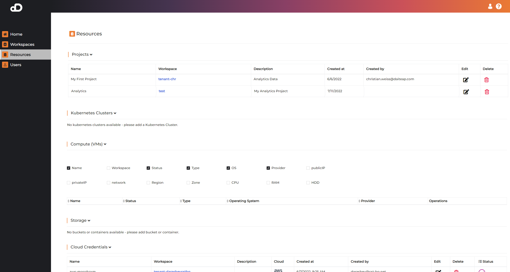
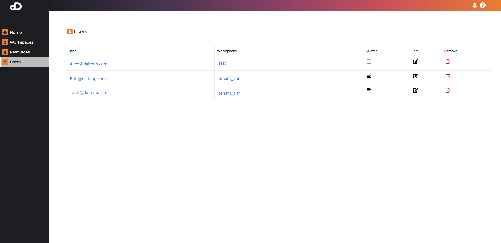
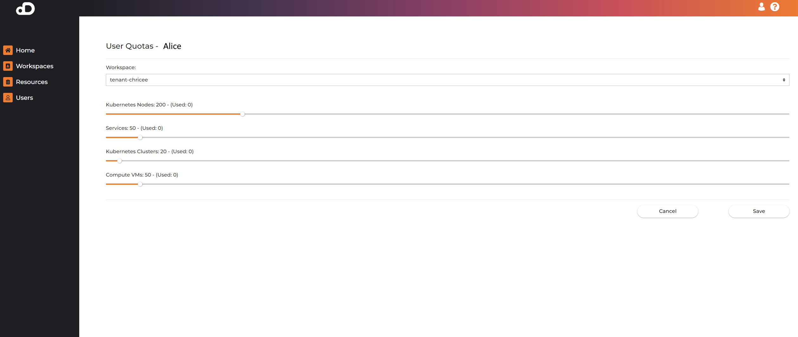

# Tenant Workspaces

Workspaces encapsulate users, projects and resources within a single scope in a multi-tenant fashion. Workspaces provide access to the Daiteap platform, for example different teams, partner organizations and units can be assigned their own tenant. The Workspace seperates users, projects and resources within a tenant, and those are only visible to the workspace owner and assigned workspace users. 
 
Within the workspace admisntration the workspace owner can switch on or off platform features for users that are members in the workspace. in our Team and Enterprise edition the Account Owner can setup and adminstrate unlimited workspace tenats which can coexist while being separated in terms of access and visibility to users and resources. 

## Workspaces

The business account adminstrator can manage all assigned workspaces, can manage users within a workspace and also provide visibility of projects and resources that are created within a workspace.

In the screenshot below you can see the list overview of existing workspaces. A new workspace can be created manually by pressing the "Add Workspace" button. Furthermore you can Edit, Delete and switch on/off Settings for various functions which should be available in the workspace.

#### Workspace Settings

The workspace settings can turn certain features ON or OFF for all users in this workspace. Below is a list of toggleable features:

- Compute - allows users to create and manage Compute VMs on target infrastructure
- Storage - allows users to create and manage S3 storage on target infrastructure
- Kubernetes CAPI - enables users to create and manage clusters using <a href="https://cluster-api.sigs.k8s.io/" target="_blank">Cluster API</a> lifecycle manager.
- Kubernetes YaookCAPI - enables users to create and manage clusters using <a href="https://yaook.cloud/" target="_blank">YaookAPI</a> lifecycle manager.
- Kubernetes K3S - enables users to create and manage <a href="https://k3s.io/" target="_blank">K3S</a> kubernetes clusters.
- Service catalog - shows/hides the service catalog feature containing curated list of applications that can be installed on managed Kubernetes clusters.
- Templates - toggle for the templates feature, which allow users to save their own cluster or compute configurations.
- Advanced Cluster Configuration - toggle for advanced cluster create wizard. Turning this on will provide more advanced and flexible options when creating a cluster. The tradeoff will be ease of use for non-experts in Kubernetes.
- Cluster Resize - toggles the resize feature for kubernetes clusters, which enables users to change the number and type of control plane and worker nodes in an existing cluster.

There is another hidden option for the Daiteap IaaS Life Cycle Manager (DLCMv2) which is always enabled.

For the Cloud Infrastructure providers you can find a set of configuration options which enable certain infrastrucutre types.
For example enabling `Microsoft Azure` will allow users to create Cloud Credentials, Kubernetes clusters, Virtual Machines, as well as Storage in Azure. 
The following types of IaaS Providers are supported:

- Amazon Web Services (AWS)
- Microsoft Azure (Azure)
- Google Cloud Platform (GCP)
- Alibaba Cloud (AliCloud)
- OpenStack / SecuStack
- On-Prem (Linux servers)
- ARM

Beware, there are dependencies in terms of what infrastructures are supported by which lifecycle managers. Here is the compatability table:

Lifcycle manager | Supported infrastructures |
---------------- | ------------------------- |
DLCMv2 | AWS, Azure, GCP, OpenStack, On-Prem, ARM  |
CAPI (Cluster API) | OpenStack, AWS, Azure, GCP |
YaookCAPI | SecuStack |

## Ressources

This page contains all resources that exist in the platform. It provides a good overview of every resource, regardless of the workspaces that it is scoped to. 

Following resources are visible:
- Projects
- Kubernetes clusters
- Compute (VMs)
- Storage
- Cloud Credentials
- Templates

## Users

This page providers and overview and management functions for users on the platform.

A table containing all users. The table gives also an overview which user belongs to which workspace. It is possible to be member of more than 1 workspace.

#### Quotas

The quotas link enables BAO to change the quota limits for each user. Following quotas are available:
- Kubernetes Nodes - maximum number of nodes for the user including all clusters
- Services - maximum number of installed applications from the service catalog
- Kubernetes Clusters - maximum number of kubernetes clusters
- Compute VMs - maximum number of compute VMs

!!! note
    All quotas are scoped to the selected workspaces, so it is possible to have different quotas in each workspace the user is member.

