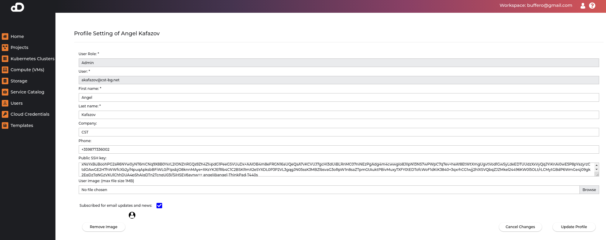

## User Management

### User Sessions

The platform is using JWT tokens for user sessions. Tokens expire after 1 day of inactivity. Every 7 days the tokens are invalidated.

### User Roles

There are 3 types of user roles - `RegularUser`, `Admin`, `BusinessAccountOwner`.

Regular and Admin users are assigned to a particular Tenant, which BusinessAccountOwner can manage all tenants in the platform.

#### `RegularUser`

This type of role has access to all features of the platform like creating Kubernetes clusters, projects and cloud credentials.

#### `Admin`

Includes all rights from `RegularUser` but can also create other users within the tenant. Admins can also see projects and cloud credentials from other users within the same tenant.

#### `BusinessAccountOwner`

This type of role can manage the whole platform via dedicated dashboard. The BAO does not have rights to create resources like Kubernetes clusters or cloud credentials, but can create tenants, assign users to tenants and provide access to the platform for teams, partners and individual customers.
There can only be a single BAO user within the platform.

### Tenants

The platform supports the notion of tenant as a separation concept for users, projects, and clusters. Resources in one tenant are separate from resources in other tenants. The BusinessAccountOwner role can create and assign tenants to clients, teams and users which should be separate from other users.

### User Management

Users panel is only available for role `Admin`.

#### Add New Users

* Click on "Users" on the left menu
* Click on "plus" button in "Add User" section
* In the "Add User" window, fill in:
    * User Role (required). User Role can be `RegularUser` or `Admin`.
    * Username (required)
    * Password (required)
    * First Name (required)
    * Last Name (required)
    * Company (optional). The field is automatically populated with the company from the current tenant.
    * Email (required)
    * Phone (optional)

#### Remove Users

* Click on "Users" on the left menu
* Click on "Trash" button in "Delete" section
* In the confirmation window, click on "Remove" button

### User Resource Quotas

Each user have a quota for the resources that can be used in the platform.
To check your quotas - click on the user icon in the top right corner and then select "Resource Quotas".

If the user exceeds the quota, the user will not be able to create new resources. To fix this, the user can contact the administrator or delete some of the existing resources.

The Business Account Owner can change quotas from the "Users" page.

!!! note
    Quota resources in the cloud providers are not managed by the platform. The quota is only for the resources that are created by the user in the platform.

### User Profile
Clicking the user settings dropdown menu at the top right corner, provides access to the user settings. By clicking on your username you reach user profile page. 

User profile fields:

* User Role - the account type, can be one of `RegularUser`, `Admin`, `BusinessAccountOwner`
* Username - username assigned to this user
* Firstname, Lastname (required)
* Company (optional) - associated company of the user
* Email - email address for the user
* Phone - phone number assigned to the user
* Public SSH key - public SSH key (used to access compute resources)
* Image - avatar picture for the user (1MB max file size)

Users can also change their password in the settings menu in the right upper corner by selecting `Change password`.
