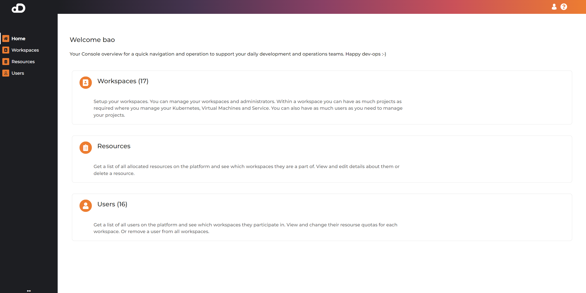
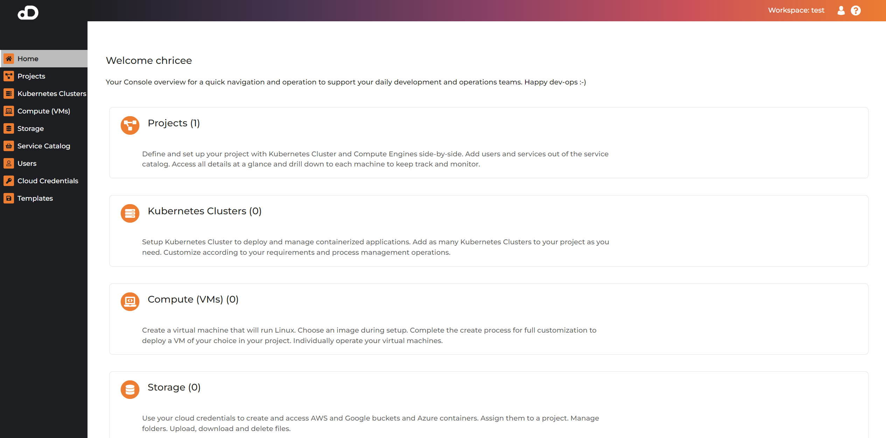
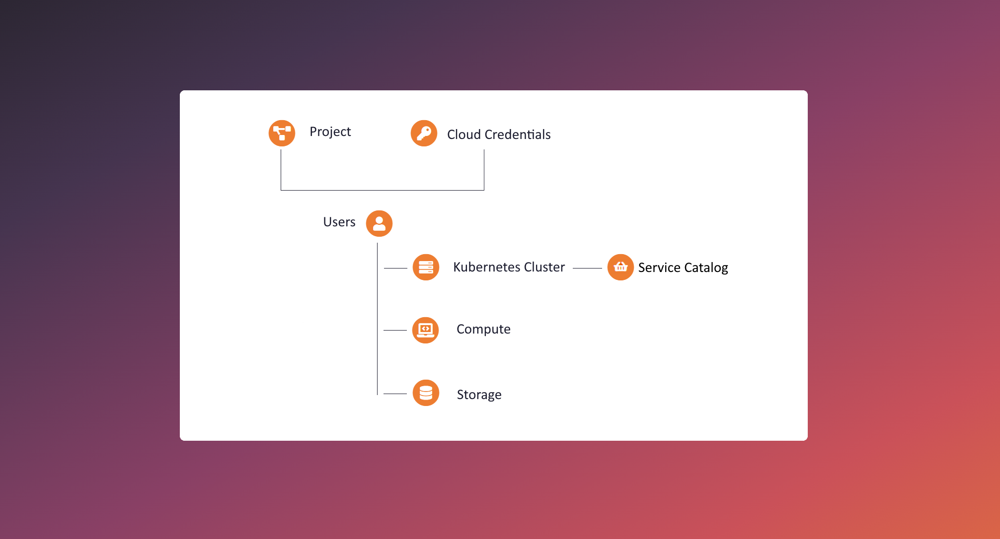
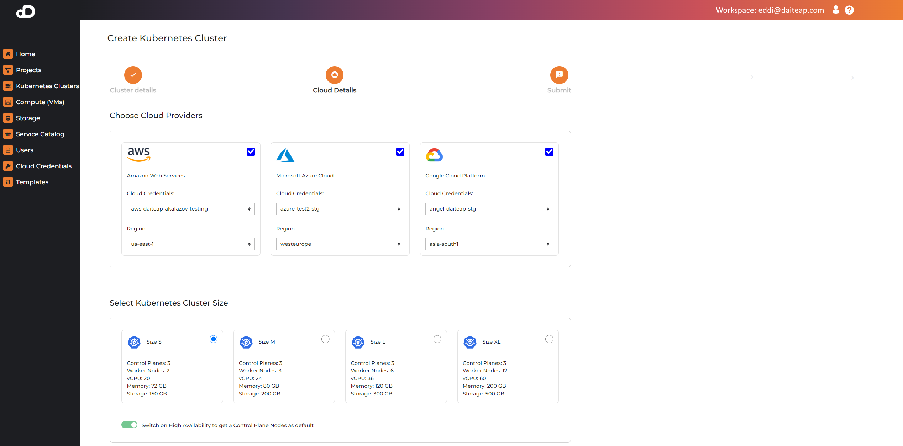
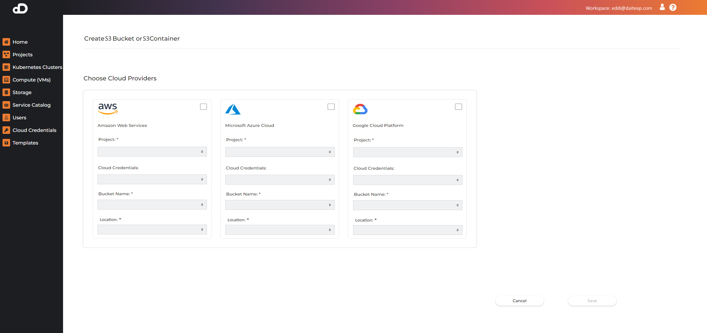
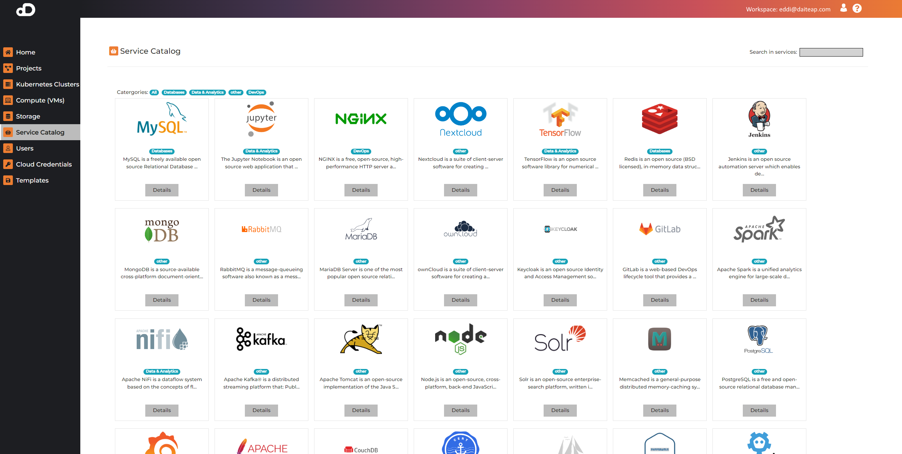

## Overview

### User & Roles

In the full version of the Daiteap Cloud Managment Platform you will find three roles of users.

+ Business Account Owner
+ Adminstrator
+ Regular User  

The Business Account Owner is only available in our Team and Enterprise Versions. 
In our free SaaS offering we will manage the business account for oyu and will setup the workspace once your registered yourself.

** Team / Enterprise Version **  
The Business Account Owner is able to login in to the tenant workspace dashboard to setup a new tenant workspace, to configure the tenant workspace, and to manage usres of that tenant wrokspace. The Business Account Owner is set the first time you start the Daiteap Cloud Management Platform. Our business account wizzard will guide you through that process. 

### Register

As a user you can register yourself via the regiser page where you need to enter your data. Please see Registration and Login for a detailed description of the process. 

### Login

Login as ** Business Account Owner **  
Enter your credentials and login to get access to the ** Tenant Workspace Management Dashboard **. 

Login as ** User **  
Enter your credentails and login to the ** Cloud Managment Dashboard ** 

### Projects

Projects are our main organisation unit for all activities across your cloud managment.
Please see our section about ** Projects ** to all the details about setting up a project and respective cloud credentials and users.  

### Kubernetes Clusters

Kubernetes Cluster can be setup using two ways 

- the PreConfigured Kubernetes Cluster console available in the Individual SaaS Offering
- the PreConfigured Kubernetes Cluster console or using the advanced settings for experienced Kubernetes users.

Please see the section [Kubernetes Clusters](/documentation/kubernetes_clusters/) for a detail explanation of working with Kubernetes Clusters. 

** Console for pre-configured Kubernetes Cluster sizes **

### Compute (Virtual Machines)

** Console for configuring Virtual Machines **

### S3 Storage

We enable the setup of S3 Stroage wihcih you can attach to your project. You can setup and choose S3 Storage and configure the location and 

** Console for configuring S3 Buckets or S3 Containers **

### Service Catalog

The service catalog contains a curated list of applications that can be installed in a Kubernetes cluster by using the Web Console.

### User Management

In the Team Version of Daiteap cloud Management Platform you have the ability to add your User Management such as LDAP or Active Directory. 
We support Open ID Connect. The Team Version come also with an Adminstration Console to add tenant workspaces and assign users to the tenant workspaces.
You can add, edit and delete users. Currently we support two roles for users. 

- Tenant Workspace Admin
- Tenant Workspace Regular User 

Please see section User Management to get full details about User [User Management](/documentation/user_management/) page for details.   

### Cloud Credentials

Cloud Crendentials are essential to simplify your cloud management. Cloud Credentails are the API Key to your Cloud Provider. 
You can setup your cloud credentials using your provider account for 

- Amazon AWS
- Microsoft Azure
- Google Cloud

We provide you detail steps how to setup those in the [Cloud Credentials](/documentation/cloud_credentials/) section.  
To setup your credentials for Openstack, Secustack or On Premise.  

### Templates

We provide a Templates mechanism to save your Kubernetes, Virtual Machine, or Storage configurations. 
While saving your configuration as a template you can repeat your setup automatically and at scale without going thru the configuration process. 

